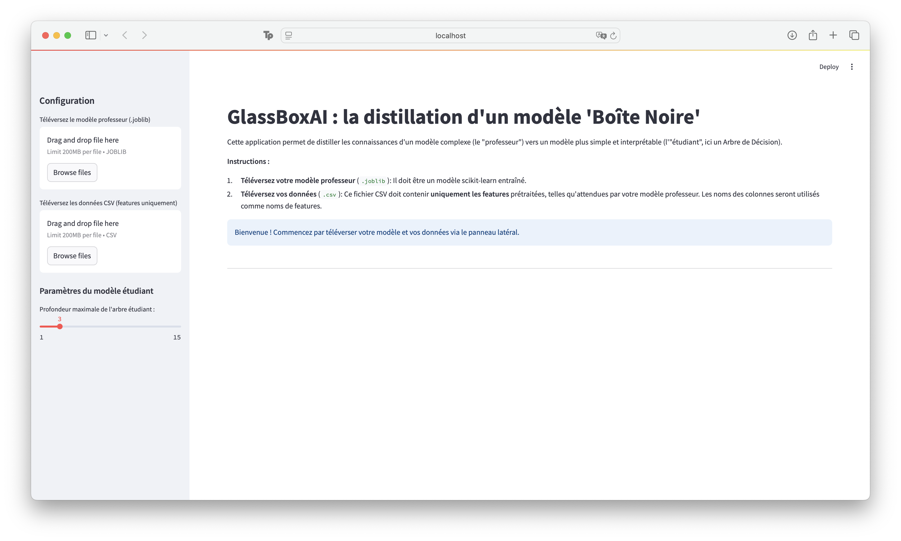
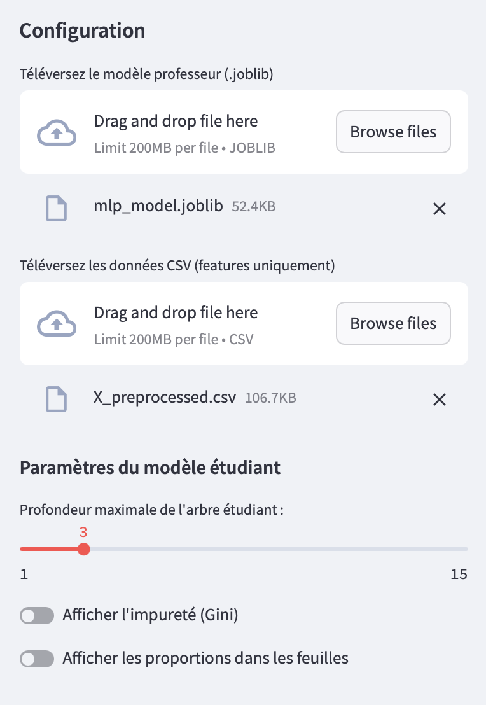
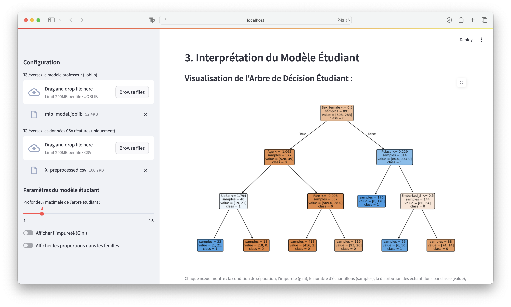
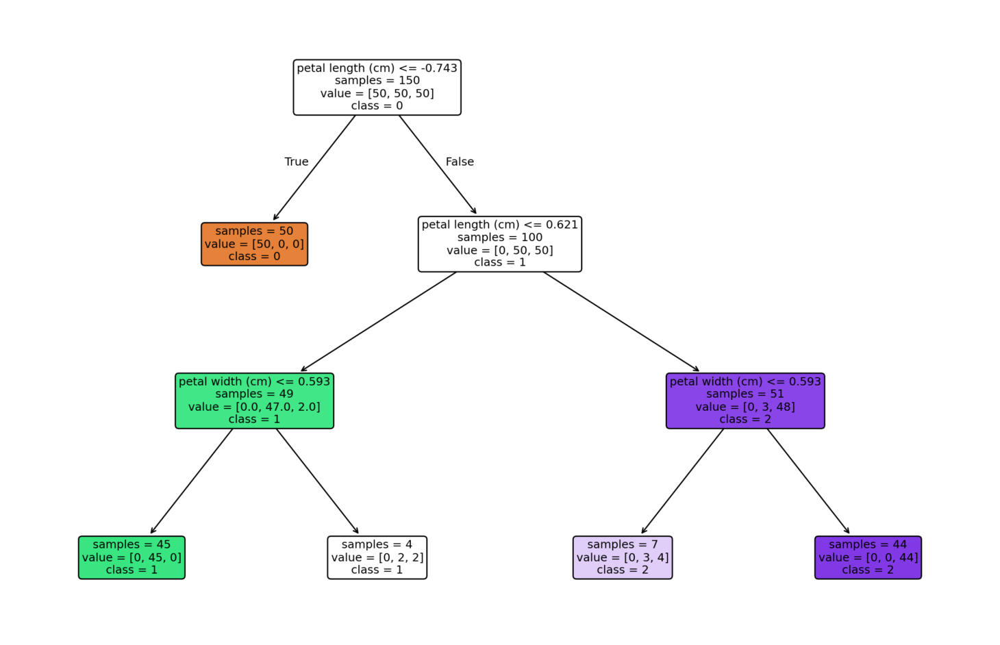
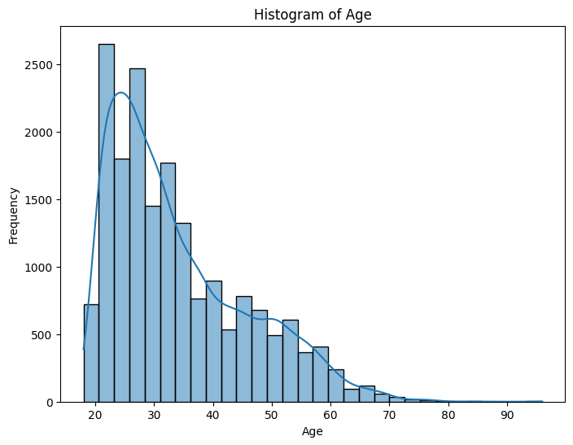
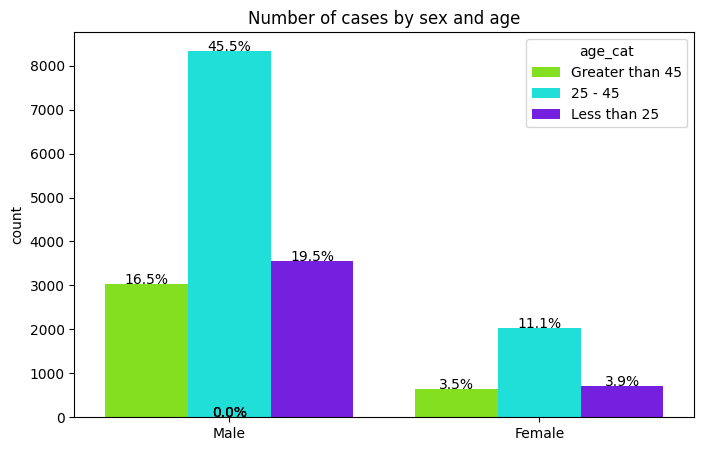

# GlassBoxAI : Distillation de Modèles "Boîte Noire"

GlassBoxAI est une application web interactive conçue pour rendre les modèles de Machine Learning opaques (boîtes noires) plus interprétables. L'outil implémente une technique de **distillation de modèle** où un modèle simple et intelligible (un "étudiant", comme un arbre de décision) est entraîné pour imiter le comportement d'un modèle complexe (le "professeur").

L'objectif est de fournir une explication globale et visuelle de la logique d'une boîte noire sur un jeu de données spécifique, facilitant ainsi l'audit, la détection de biais et la confiance dans les systèmes d'IA.

## Fonctionnalités

  * **Upload facile :** Chargez votre modèle boîte noire pré-entraîné (`.joblib`) et votre jeu de données (`.csv`).
  * **Contrôle interactif :** Ajustez dynamiquement la complexité (profondeur) de l'arbre de décision étudiant pour trouver le bon équilibre entre fidélité et simplicité.
  * **Évaluation de la fidélité :** Calculez instantanément à quel point le modèle étudiant parvient à imiter le modèle professeur.
  * **Visualisation intuitive :** Obtenez une représentation graphique claire de l'arbre de décision, rendant la logique du modèle transparente.

## Démonstration de l'application

Le processus se déroule en trois étapes simples guidées par l'interface.

#### Étape 1 : Accueil et Configuration
L'utilisateur est accueilli par une interface sobre expliquant le but de l'application. Le panneau latéral permet de charger le modèle "professeur" (`.joblib`) et le jeu de données (`.csv`).



#### Étape 2 : Contrôle et Paramètres
Une fois les fichiers chargés, l'utilisateur peut interagir avec les paramètres du modèle "étudiant" pour ajuster la complexité de l'interprétation, notamment via un curseur pour la profondeur de l'arbre.



#### Étape 3 : Visualisation et Interprétation
Après l'entraînement, l'application affiche la fidélité du modèle étudiant et, surtout, la visualisation complète de l'arbre de décision. Chaque nœud et chaque feuille peuvent être inspectés pour comprendre la logique capturée par le modèle.



### Exemple Simple : Le Dataset Iris

Pour illustrer la clarté du résultat, voici un arbre de décision généré par l'application pour le célèbre dataset Iris. On peut suivre distinctement les règles qui permettent de séparer les différentes espèces de fleurs en se basant sur la longueur et la largeur de leurs pétales.



## Étude de Cas : Analyse de Biais du Dataset COMPAS

Avant d'analyser les biais du modèle, il est essentiel de comprendre la composition du dataset COMPAS. Les graphiques ci-dessous, générés en amont de l'analyse, montrent une population carcérale majoritairement jeune et une forte surreprésentation des prévenus afro-américains, ce qui constitue un risque de biais pour l'entraînement.

<table align="center">
  <tr valign="top">
    <td align="center">
      <b>Distribution de l'âge des prévenus</b><br>
      
    </td>
    <td align="center">
      <b>Répartition des cas par sexe et âge</b><br>
      
    </td>
  </tr>
</table>

Nous avons utilisé cet outil pour analyser les biais potentiels d'un modèle entraîné sur le célèbre dataset **COMPAS**. L'objectif était de vérifier si l'ethnie était un facteur de décision important.

#### Analyse avec toutes les features

Avec une fidélité de 86%, le modèle se base principalement sur le nombre d'antécédents (`priors_count`) et l'âge, sans faire apparaître l'ethnie dans les premiers niveaux de décision.

#### Analyse sans `priors_count`

En retirant la variable la plus prédictive (`priors_count`), l'arbre surrogat montre que le modèle utilise alors l'ethnie (`race_African-American`) comme un critère de décision de haut niveau, probablement en raison du déséquilibre statistique dans les données.

Cette étude de cas montre comment l'outil peut être utilisé pour l'audit d'équité et l'analyse fine du comportement d'un modèle.

## Technologies Utilisées

Ce projet est construit avec les technologies suivantes :

  * **Python** pour le développement backend
  * **Streamlit** pour l'interface web interactive 
  * **Scikit-learn** pour l'entraînement des modèles de Machine Learning 
  * **Pandas** pour la manipulation des données 
  * **Matplotlib** pour la visualisation des graphiques 
  * **Joblib** pour le chargement des modèles pré-entraînés 

## Installation et Lancement

Pour lancer l'application sur votre machine locale, suivez ces étapes :

1.  **Clonez le dépôt :**

    ```bash
    git clone https://github.com/MathisAulagnier/Interpr-table_ML
    cd INTERPR-TABLE_ML
    ```

2.  **Créez un environnement virtuel et activez-le :**

3.  **Installez les dépendances :**

    ```bash
    pip install -r requirements.txt
    ```

4.  **Lancez l'application Streamlit :**

    ```bash
    streamlit run app.py
    ```
